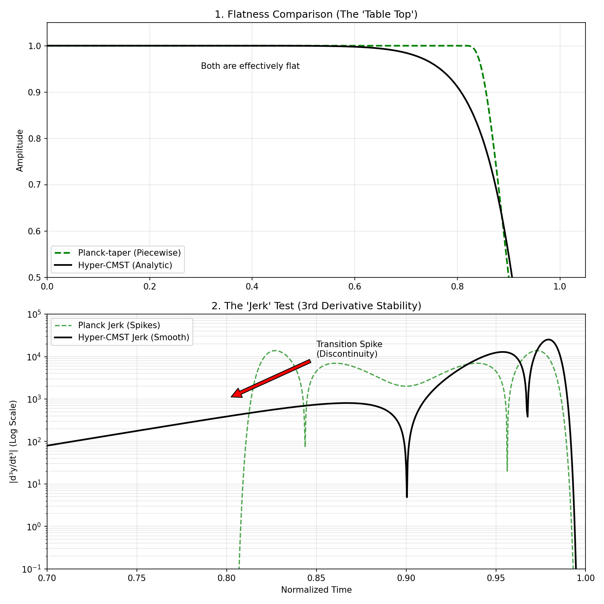

# cmst-window
**The analytically sound, zero-preserving, interlace-preserving window.**

[](https://creativecommons.org/licenses/by-nc-sa/4.0/)
[](https://github.com/yourusername/cmst-window)
[](https://github.com/yourusername/cmst-window)

### 🚀 The Problem
Signal processing engineers often need a "Flat-Top" window to preserve signal amplitude while filtering noise. Existing standard solutions force a dangerous compromise:

* **Truncated Super-Gaussians:** Create **geometric singularities** (infinite acceleration) at the boundaries, causing ringing in control loops.
* **Planck-taper (LIGO Standard):** Theoretically perfect flatness, but relies on **piecewise "stitching"** of functions. This creates impulsive "kicks" (discontinuities) in higher-order derivatives (Jerk/Snap) and makes hardware optimization difficult.

### 🔬 Theoretical Basis: CMST Theory
This window is an implementation of **CMST (Cosh Moment Sturm Transform)**. Unlike standard windows which are often heuristic curve-fits, the Hyper-CMST window is constructed as a **Geometric Mollifier** with three rigorous guarantees:

1.  **Analytically Sound ($C^\infty$):**
    The function is infinitely differentiable with no discontinuities in any derivative $f^{(n)}$. This eliminates the "spectral ringing" and mechanical jerk caused by piecewise functions like the Planck-taper or Tukey window.

2.  **Zero-Preserving (Laguerre-Pólya Class):**
    Derived from CMST theorey, the kernel guarantees the preservation of realness in the signal chain. It does not introduce artificial complex roots (phantom oscillations) into the passband.

3.  **Interlace-Preserving Transform:**
    For the first $n$ derivatives, the window acts as a variation-diminishing operator. It preserves the root-interlacing structure of the underlying signal, ensuring that derivative noise is bounded and geometric topology is maintained even at the boundaries.

### 💡 The Formula (Hyper-CMST)
We utilize a compensated log-concave mollifier that cancels low-order curvature to achieve "Hyper-Flatness":

$$
w(t) = \exp\left(t^n - \frac{1}{1-t^n}\right)
$$

* **Compensating Term ($+t^n$):** Cancels the Gaussian curvature at the origin, extending the "Table-Top" flatness to order $2n$.
* **Mollifier Term ($-1/(1-t^n)$):** Enforces strict compact support with essential singularities at the boundaries, ensuring all derivatives decay to zero smoothly.

### 📉 The "Jerk" Test (Proof)
Why does analytic smoothness matter? In control systems (e.g., drones, robotics), the 3rd derivative (Jerk) corresponds to mechanical stress.

* **Planck-taper (Green):** Shows "impulsive" spikes in the Jerk plot where the flat section stitches to the curve. This is hidden noise.
* **Hyper-CMST (Black):** A perfectly smooth, continuous wave.



### 📦 Installation

```bash
git clone [https://github.com/aronp/CMST.git](https://github.com/aronp/CMST.git)

cd CMST

pip install .
