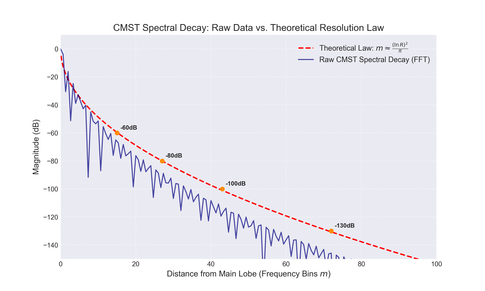
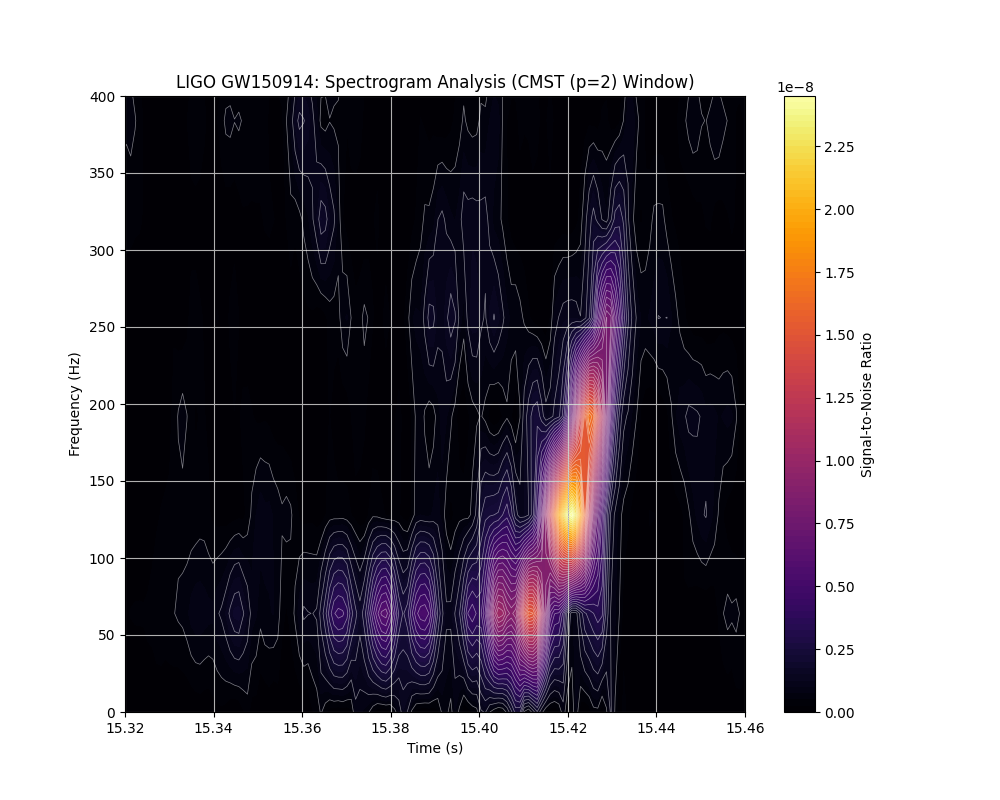
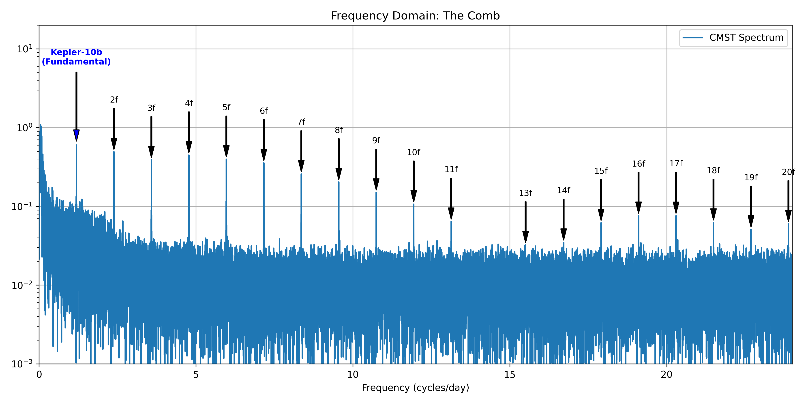
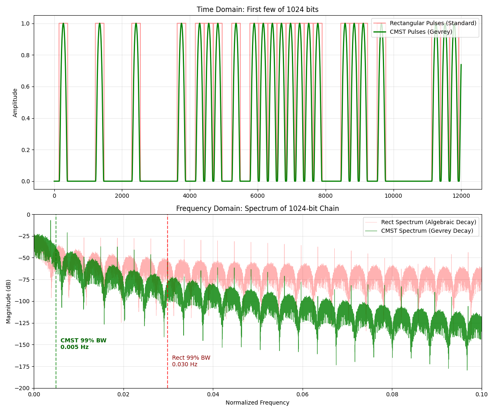

# cmst-window
**The analytically sound, zero-preserving, interlace-preserving compact window.**
[](https://opensource.org/licenses/MIT)
[](https://github.com/aronp/CMST/blob/main/cmst.pdf)

### 🚀 The Problem
Signal processing engineers often need a "Flat-Top" window to preserve signal amplitude while filtering noise. Existing standard solutions force a dangerous compromise:

* **Truncated Super-Gaussians:** Create **geometric singularities** (infinite acceleration) at the boundaries, causing ringing in control loops.
* **Planck-taper (LIGO Standard):** Theoretically perfect flatness, but relies on **piecewise "stitching"** of functions. This creates impulsive "kicks" (discontinuities) in higher-order derivatives (Jerk/Snap) and makes hardware optimization difficult.

### 🔬 Theoretical Basis: CMST Theory
This window is an implementation of **CMST (Cosh Moment Sturm Transform)**. Unlike standard windows which are often heuristic curve-fits, the CMST window is constructed as a **Geometric Mollifier** with three rigorous guarantees:

1.  **Analytically Sound ($C^\infty$):**
    The function belongs to the Gevrey class of regularity ($s=2$), ensuring super-algebraic decay in the frequency domain. It is infinitely differentiable ($C^\infty$) with no discontinuities in any derivative. This eliminates the "spectral ringing" and mechanical jerk caused by piecewise functions like the Planck-taper or Tukey window.

2.  **Zero-Preserving :**
    Derived from CMST theory, the kernel guarantees the preservation of realness in the signal chain. It does not introduce artificial complex roots (phantom oscillations) into the passband.

3.  **Interlace-Preserving Transform:**
    For all derivatives, the window acts as a variation-diminishing operator. It preserves the root-interlacing structure of the underlying signal, ensuring that derivative noise is bounded and geometric topology is maintained even at the boundaries.

### 💡 The Formula (CMST)
We utilize a compensated log-concave mollifier that cancels low-order curvature to achieve Flatness:

$$
w(t) = \exp\left(1+t^p - \frac{1}{1-t^p}\right), 
$$

where p is even.

* **Compensating Term $t^p$:** Cancels the Gaussian curvature at the origin, extending the "Table-Top" flatness to order $2n$.
* **Mollifier Term $(-1/(1-t^p))$ :** Enforces strict compact support with essential singularities at the boundaries, ensuring all derivatives decay to zero smoothly.


### 🎛️ Tunable Flatness (p-Control)

Unlike traditional windows which are locked to a single profile (e.g., Hann, Blackman), the CMST window is a parametric family. The power parameter (p) allows you to tune the window's behavior to match your specific engineering constraint:

    Mode A: The "Brick Wall" (p=6 or higher)
        Goal: Maximal Amplitude Accuracy.

        Behavior: The window remains effectively flat (>0.99) for over 70% of the duration, ensuring that signals are not attenuated in the center.

    Mode B: The "Silencer" (p=2)
        Goal: Maximal Spectral Purity.

        Behavior: The window converges to an analytically smooth Gaussian-like profile. This sacrifices the "flat top" to achieve significantly faster side-lobe decay, often over 100dB improvement, diving into the noise floor deeper than standard piecewise functions like the Planck-taper.
        Generally I have found p=2 gives the best results.

### 📉 Tunable Flatness


### 📉 Spectral Leakage Comparison


Note on Precision Limits: The CMST response (Blue) was calculated using 100 digit precision arithmetic to demonstrate the asymptotic behavior beyond standard 64-bit machine limits (~ -320 dB).
Polynomial Windows (e.g., Blackman-Harris, Planck): Their leakage floors are theoretical. Even with infinite precision, they would not drop much further and the graph wouldnt change much


### 📉 Performance Analysis: 

**Detection of a -100 dB weak signal (1.3 kHz) next to a strong carrier (1.0 kHz).**

The standard Planck-taper (Red) buries the target in spectral leakage. The CMST window (Blue) resolves it clearly with >30 dB of headroom


**Transform of a Sinc function**


Lets remember that when I say these should be a box, we are using a log scale, visually they are all boxes.

Total Integrated Leakage (0.05 - 0.07 Hz):

Planck Taper:  -20.86 dB

7-term BH:     -16.21 dB

CMST (p=2):    -28.44 dB

Improvement:   7.58 dB

**Planet sim.**


With the planet dB at -80 dB and a noise floor of -90 dB.  Slightly contrived, but the windows I am comparing against are good!
Note that not only has Planck lost 4 planets, but it has also created non existant mountains (side lobes).  We are looking at this in crazy detail, if we were back in the real world, the -80dB planets would not show up on your screen, your eyes couldnt see them.  Those "mountains" are invisible as well. 80dB is the ratio between the Empire State Building and a golf ball.


### 📉 Resolution Law: 
As part of this work we produce a resolution law for CMST(2) for the resolution of two signals in terms of bins, namely

$$m = \left\lceil \frac{(\ln R)^2}{\pi} \right\rceil$$

Where:
* **$R$** is the linear ratio of amplitudes (e.g., for -100 dB, $R = 10^5$).
* **$m$** is the distance required between the signals in bins.


Theortical law vs practical. (There is actually a small log term that gives the law a bit of a boost, by which I mean m bins are sufficient)



### 📉 GW150914 (The first Gravity wave detected)


To benchmark performance on real-world signals, the CMST window was applied to the raw 4kHz data from GW150914, the first direct detection of gravitational waves.

### 📉 Kepler 10



Running the window on the Kepler 10 data, a detection of a planet orbitting a sun, we get a frequency plot with clear harmonics.  When we run a regression on these harmonics we get an R^2 of ~0.99997 and an estimate of the rotation period of 0.8386 days, which is within 0.1% of the NASA number, or roughly out by only 114 seconds.

### 📉 Data Preparation

Do not pre-filter your data.

The CMST algorithm operates well on raw time-series data. Applying standard signal processing filters before the transform will degrade performance since they have algerbraic side lobes which CMST wont be able to remove.


You can:

Fill Gaps: Use linear interpolation to ensure a rigid time grid.
Center the Data: Subtract the mean to remove the DC offset.
and then apply CMST.

Note: The CMST window provides sufficient dynamic range to isolate other signals from the signal of interest in the frequency domain. Pre-filtering is redundant and destructive.

###  🎛️ Performance Trade-offs: SNR vs. Spectral Decay

The CMST window family allows you to tune the shape parameter **p** to balance Coherent Gain (SNR) against the speed of Spectral Decay.

Where spectral decay is
$$|\hat{\Psi}(\omega)| \propto e^{a \sqrt{\omega}}$$

| Window Variant | Parameter (p) | SNR Loss (vs Rect) | Spectral Decay (a) | 
| :--- | :---: | :---: | :---: | 
| **Rectangle** | N/A | **0.00 dB** | N/A | 
| **Std. Bump** | N/A | -1.30 dB | -1.92 | 
| **CMST(2)** | p=2 | -0.96 dB | -1.91 | 
| **CMST(4)** | p=4 | -0.50 dB | -1.40 | 
| **CMST(6)** | p=6 | -0.34 dB | -1.19 | 

**Key Metrics:**
* **SNR Loss:** Signal loss relative to a perfect Rectangular window. Lower is better (closer to 0 dB).
* **Spectral Decay:** The slope constant 'a' describing how fast the side-lobes vanish. More negative is better/faster.

The numbers here are numeric estimates, but they show there is a balance between SNR and Side lobe decay.  CMST(2) is a general workhorse but CMST(4) for instance got me down to within 2 seconds of NASA's orbit time for Kepler 10 where SNR is probably more important than spectral resolution.

The **Std. Bump** (often denoted as $\Psi$ in distribution theory) is the canonical example of a smooth, compactly supported function ($C_c^\infty$). It serves as the baseline ancestor for the CMST window family.

$$
\Psi(t) = \exp\left(\frac{1}{t^2 - 1} \right) 
$$

It has the best spectral decay, but CMST(2) is almost the same and has a better SNR.

Traditional windows (like Hann, Hamming, or Blackman) exhibit algebraic spectral decay. Because they decay much slower (following a polynomial curve rather than an exponential one), they do not possess a comparable decay constant $a$.

###  🎛️ Using CMST as a signal

We can use the super algerbraic side lobe decay to confine a signal into a lower bandwidth.



Note the CMST 99% bandwidth is 5 times smaller than the Rectangular window 99% bandwidth
  
### 📉 The Math: 
Behind all of this there is a CMST theory paper here [CMST](cmst.pdf)


### 📦 Installation

```bash
git clone https://github.com/aronp/CMST.git

cd CMST

pip install .
